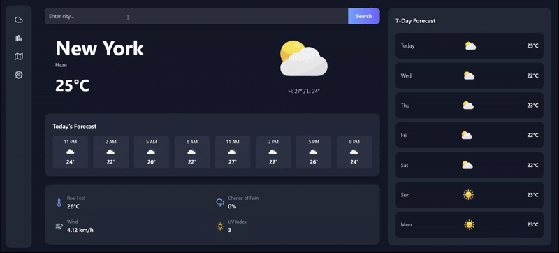

# 🌤️ Modern Weather App


A sleek and modern weather app built with **React + Vite + TailwindCSS + Framer Motion**.

---

## 🎥 Preview



*(Replace with your own GIF or screenshot — e.g. `/public/demo.gif` or an uploaded image to GitHub)*

---

## ✨ Demo

🔗 [Live Demo on Vercel](https://your-app-url.vercel.app)  

---

## 📸 Screenshots

(Add screenshots of your app here — PNGs, GIFs, or Loom links)

---

## ⚡ Features
- Search for any city and instantly view its weather.  
- **Today’s Forecast**: next 8 hours at a glance.  
- **7-Day Forecast**: evenly distributed, dynamic grid layout.  
- Animated results on each search with **Framer Motion**.  
- Clean UI powered by **TailwindCSS**.  

---

## 🛠️ Tech Stack
- **React** (with Vite bundler) ⚡
- **TailwindCSS** for styling 🎨
- **Framer Motion** for animations 🎬
- **OpenWeather API** 🌍
- **Vercel** for deployment 🚀

---

## 🚀 Getting Started

### Prerequisites
- Node.js & npm installed.

### Installation
```bash
# Clone the repo
git clone https://github.com/your-username/weather-app.git

# Enter the project folder
cd weather-app

# Install dependencies
npm install

# Run locally
npm run dev
```

### Environment Variables
Create a `.env` file in the root:
```
VITE_API_KEY=your_openweather_api_key
```

---

## 📦 Deployment
This app is deployed with [Vercel](https://vercel.com).  
Every push to the `main` branch triggers an automatic redeployment.

---

## 📝 License
MIT License © [Your Name]  
